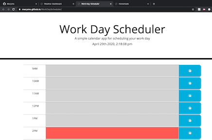

# Work Day Scheduler
<<<<<<< HEAD

## Description
A simple calendar application that allows the user to save events for each hour of the day. This app runs in the browser and features dynamically updated HTML and CSS powered by jQuery. The Moment.js library was used to work with date and time.

## Table of Contents

* [Usage](#usage)
* [Contributing](#contributing)
* [Questions](#questions)

## Usage
https://macymo.github.io/WorkDayScheduler/

## Contributing
Contact Me

## Questions
Macymo
=======

## Description
A simple calendar application that allows the user to save events for each hour of the day. This app runs in the browser and features dynamically updated HTML and CSS powered by jQuery. The Moment.js library was used to work with date and time.

## Table of Contents

* [Usage](#usage)
* [Contributing](#contributing)
* [Questions](#questions)

## Usage
https://macymo.github.io/WorkDayScheduler/

## Contributing
Contact Me

## Questions
Macymo

>>>>>>> f08f63420e2ae7762077b0b801091496004e8f92
